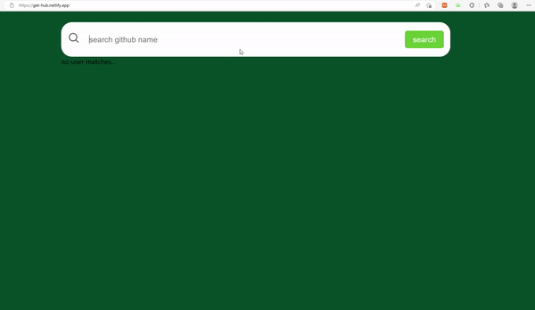

🏷 https://get-hub.netlify.app/

# 페이지

- 📄 `Home.js` (path: `/`)

  검색 결과 값을 저장하고 있는 변수 `resultData` state를 관리하고, 검색 시의 화면을 출력하는 페이지. `Main.js` 컴포넌트를 출력한다.

- 📄 `User.js`(path: `/users/:id`)

  유저의 상세 페이지를 출력하는 페이지. 페이지가 렌더링될 때, 유저의 `github name`을 기반으로 상세 정보를 가져오는 api를 요청하여 응답 값으로 출력한다.

# 컴포넌트 구조

- 📁 `Main`

  - 🧩 `Main.js`

    `Home` page의 `<main>`섹션을 담당하며, 출력할 결과가 있는지 없는지에 따라 다른 화면을 표시하고, 값이 있다면, `MainItem.js`에 출력할 결과 배열을 순회하며 아이템의 값을 prop으로 전달

  - 🧩 `MainItem.js`

    > 검색 결과 출력시 재사용되는 카드 컴포넌트들이므로 따로 분리

    부모 컴포넌트인 `Main.js`로부터 prop으로 받아온 아이템의 프로퍼티 값을 JSX Element와 함께 출력하고, 아이템의 상세 페이지로 이동할 수 있도록 함

- 📁 `Navbar`

  - 🧩 `Navbar.js`

    `Home` page와 `User` page 모두에 출력되는 컴포넌트. 검색어 입력 form에서 입력된 값에 대한 유효성을 검사하고, 통과될 경우 api 요청을 하여 그 응답을 `Home` page가 관리하고 있는 `resultData`의 값으로 갱신하는 `getUsers` 함수가 호출됨.

# react-query로 데이터 캐싱

> 타이핑이 종료된 후 요청하는 데이터의 중복 방지

- 타이핑이 종료된 후 api 요청

  - react-query로 응답 받아온 데이터 캐싱

- 검색 버튼을 눌러도 다시 네트워크 통신을 하지 않음

  

# 이슈

## 에러 핸들링

1. 빈 문자열로 요청할 경우

   빈 문자열일 경우 http 요청에 실패하기에 입력 값을 받을 때, 빈 문자열 혹은 `null` 값으로 api를 요청하지 않도록 예외처리를 해야 한다.

2. 없는 사용자를 요청할 경우

   역시 http 요청이 실패하고, 404에러를 띄울 때 이때 json으로 parse해보면 `Not Found` 메시지가 출력된다. 이에 대한 상태코드를 읽어 예외 처리를 했다.
